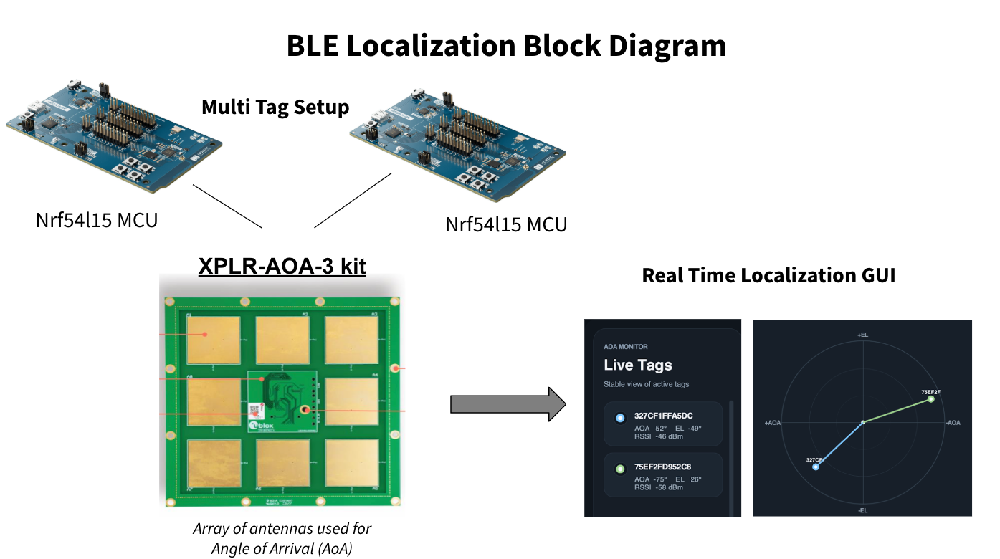

# Porting the u-blox C209 AoA Tag to a Nordic Firmware Platform

This project ports the behavior of the u-blox C209 Bluetooth AoA tag onto a Nordic sample-based firmware stack so that a u-blox ANT-B10 / ANT-B11 anchor can still recognize and localize the tag.

The main challenge was not just generating a Constant Tone Extension. The u-blox anchor also expects a specific BLE advertising format, especially an Eddystone-UID payload with the namespace `NINA-B4TAG`. The work in this repo identifies those expectations by comparing the original C209 firmware against Nordic’s `direction_finding_connectionless_tx` sample, then re-implements the needed pieces on the Nordic side.

The repo contains:

- a vendored copy of the original u-blox C209 firmware for reference
- a Nordic-based port under `nrf54_aoa_tag/`
- a simple local dashboard that visualizes `+UUDF` angle reports from the anchor

At a high level, the system works like this:

1. The Nordic board advertises as a compatible AoA tag.
2. The u-blox anchor receives the BLE packets and computes angle estimates.
3. The anchor emits `+UUDF` serial messages.
4. The host dashboard plots the reported tag angles.

This repository is best understood as a functional porting and interoperability project rather than a finished product. The strongest result so far is compatibility with the u-blox anchor’s expected advertising behavior, especially the Eddystone namespace and unique instance ID handling.
